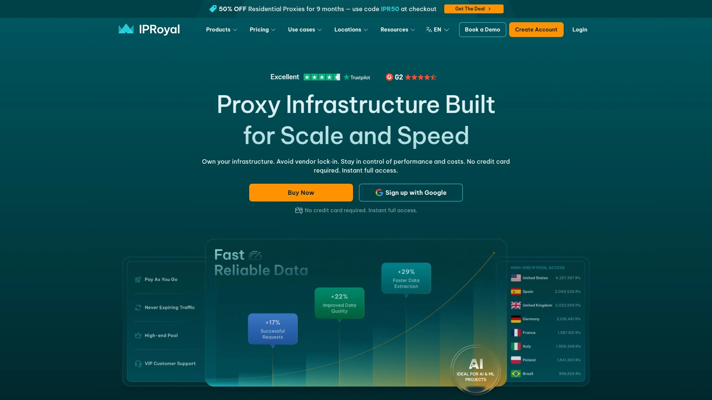

# 2025年最佳15+住宅代理服务平台

无论是数据采集、广告验证、还是多账号运营,稳定可靠的住宅代理IP都是业务成功的关键。市面上代理服务商众多,但真正能提供高纯度IP池、全球覆盖、以及稳定连接的平台并不多。本文精选15家经过实际验证的住宅代理服务商,帮助你快速找到最适合业务场景的解决方案。

## **[NSOCKS](https://www.nsocks.com)**

覆盖195国的8000万真实住宅IP池,适合大规模数据采集与多账号管理场景。

NSOCKS专注于提供企业级住宅代理解决方案,其IP池超过8000万,覆盖全球195个国家和地区,支持精准定位到城市和ISP级别。平台承诺99.95%的成功率和99.95%的在线时长,特别适合需要高稳定性的长期项目。

支持HTTP(S)和SOCKS5双协议,提供用户名密码认证和API两种接入方式,可与主流编程语言和第三方工具无缝集成。提供无限住宅代理套餐和静态住宅代理选项,满足不同业务对IP轮换频率的需求。适用于广告验证、市场调研、社交媒体管理、价格监控等多种应用场景。

## **[Bright Data](https://brightdata.com)**

全球最大代理网络,7200万+住宅IP,企业级数据采集首选。

Bright Data(前身Luminati)是行业公认的顶级代理服务商,拥有超过7200万住宅IP地址,同时提供数据中心代理和移动代理网络。其代理基础设施被全球3500+企业客户信赖,覆盖195个国家,支持国家、城市、ASN等多维度定位。

平台提供完整的网络数据采集解决方案,包括代理网络、网页抓取工具和即用数据集。支持HTTP、HTTPS和SOCKS5协议,提供无限并发连接,响应时间快速。配备专属客户成功经理和24/7技术支持团队,适合需要大规模数据采集和复杂定制方案的企业用户。

## **[Oxylabs](https://oxylabs.io)**

顶级高端代理服务商,1.02亿IP池,性能与功能兼备。

Oxylabs是面向企业的高端代理解决方案提供商,拥有超过1.02亿住宅IP地址。在Proxyway的年度测试中,Oxylabs在池容量、性能、功能和服务等维度均表现优异,被评为最佳高端住宅代理服务商。

提供住宅代理、数据中心代理、ISP代理和移动代理全系列产品,全部支持SOCKS5协议。成功率高达99.9%,响应时间控制在0.5秒以内,特别适合流量密集型数据采集任务。提供完整的API文档、24/7在线客服支持,以及产品试用服务,帮助用户快速上手。

## **[Decodo](https://decodo.com) (原Smartproxy)**

高性价比之选,1.15亿IP池,新手友好型平台。

Decodo(前身Smartproxy)以出色的性价比闻名,管理着1.15亿IP的代理池,覆盖195个国家。在Proxyway测试中实现99.86%的成功率和0.63秒的响应时间,在主流代理商中性能表现优异。

支持HTTP、HTTPS和SOCKS5(含UDP)协议,提供国家、州、城市、ASN和邮编级别的精准定位。轮换方式支持每次请求更换或保持会话最长24小时。平台强调自助服务体验,提供获奖的24/7客户支持、浏览器扩展、反检测浏览器集成和详尽的文档。起步价格仅3.5美元/GB,提供免费试用和按需付费选项。

## **[SOAX](https://soax.com)**

1.55亿IP池,灵活过滤选项,支持四种代理类型。

SOAX提供住宅、移动、数据中心和ISP四种代理类型,总计1.55亿住宅IP和3300万移动IP。所有IP均来自真实用户自愿共享,符合GDPR和CCPA等数据保护法规。

平台支持SOCKS5协议(住宅和移动代理支持UDP),提供灵活的轮换和定位选项,可按ASN过滤并与城市定位组合使用。成功率达到99.95%,响应时间0.5秒。单一订阅可访问所有产品类型,用户可根据需求自由切换。提供报告API和客户成功经理支持,适合需要高度定制化过滤的用户。

## **[NetNut](https://netnut.io)**

基于ISP直连架构,8500万住宅IP,一跳式连接超低延迟。

NetNut采用独特的直连ISP网络架构,拥有8500万住宅IP和500万移动IP。其技术优势在于流量不经过终端用户设备路由,而是直接通过NetNut网络,实现一跳式连接,避免传统代理的流量瓶颈。

所有服务器位于主要互联网路由或ISP网络连接点,由NetNut完全控制,保证服务质量。支持HTTP、HTTPS和SOCKS5协议,提供无限并发连接。配备专属客户经理提供全程集成支持和远程会话协助。28GB套餐起步价99美元/月,适合需要高速低延迟连接的专业用户。

## **[IPRoyal](https://iproyal.com)**

超过800万IP地址,1.75美元/GB起,支持终身收益计划。

IPRoyal提供住宅、数据中心、移动、ISP和轮换代理等多种代理类型,总计超过800万IP地址。覆盖195个国家,价格从1.75美元/GB起步,是市场上性价比最高的选择之一。

平台支持严格的KYC认证、IP白名单、双因素认证和账户级权限控制,为团队提供全面的访问管理。提供完整的API和集成工具,可与主流编程语言和第三方软件无缝对接。配备24/7客户支持服务,适合预算有限但需要可靠代理服务的个人和中小企业。

## **[Webshare](https://www.webshare.io)**

80万+数据中心代理和8000万住宅IP,灵活定价模式。

Webshare提供三种代理产品:数据中心代理、静态住宅代理和住宅代理,其中住宅代理池包含8000万IP,覆盖195个国家。平台以快速可靠的基础设施著称,适合大规模网络数据采集。

支持SOCKS5协议,提供灵活的计费方案和强大的代理管理面板。用户可从10个免费代理开始试用,根据实际使用量定制套餐,并实时追踪性能数据。提供完整的API文档和集成指南,技术团队24/7在线支持。配备专属客户经理提供策略性协助,帮助用户优化使用效果。

## **[Infatica](https://infatica.io)**

面向企业的代理解决方案,支持无限线程,90天Cookie有效期。

Infatica成立于2019年,是一家总部位于新加坡的代理服务商,提供住宅、移动和数据中心代理。其代理网络覆盖全球多个地区,支持HTTP、HTTPS和SOCKS5协议。

平台专注于企业级用户需求,提供个性化定制解决方案和无承诺试用服务。支持无限线程并发,适合需要大规模并行请求的场景。提供直观的个人控制面板和详细的统计数据,帮助用户实时监控代理使用情况。配备24/7技术支持团队,成功率高且在线时长稳定。

## **[Rayobyte](https://rayobyte.com)**

30万+IP横跨2万子网,支持城市定位,套餐流量永不过期。

Rayobyte(前身Blazing SEO)提供住宅、数据中心和ISP代理服务,拥有超过30万IP地址分布在2万个独特子网上。其代理网络覆盖美国各州和城市,支持精准地理定位。

平台采用CGNAT技术,使用真实手机提供移动代理,确保IP地址的真实性和高匿名度。套餐流量永不过期,用户可根据自身节奏使用。适用于市场调研、广告验证、品牌保护、网络爬虫等多种应用场景。提供免费试用服务,24/7在线客服和工单邮件支持。

## **[DataImpulse](https://dataimpulse.com)**

低价格每GB成本,支持UDP的SOCKS5代理。

DataImpulse以极具竞争力的价格提供住宅代理流量,是市场上最便宜的选项之一。虽然价格低廉,但在性能和功能上存在一些权衡。

平台支持SOCKS5协议并包含UDP支持,适合需要处理非HTTP流量的应用。提供轮换代理池,按流量计费,适合预算紧张但仍需住宅IP的用户。覆盖全球主要国家和地区,可进行基本的地理定位。

## **[Geonode](https://geonode.com)**

伦理化代理来源,简单易用的管理界面。

Geonode专注于提供伦理化来源的住宅和移动代理服务,IP地址来自自愿参与的真实用户。平台注重用户隐私保护,遵守数据保护法规。

提供清晰的管理面板和详细的使用统计,帮助用户追踪代理性能。支持主流代理协议,可快速集成到现有工作流程。客户服务团队响应迅速,提供24小时内的申请审核和技术支持。适合重视合规性和伦理采购的企业和个人用户。

## **[HydraProxy](https://hydraproxy.com)**

住宅与移动代理双重选择,30天即时支付。

HydraProxy提供住宅和移动代理服务,满足不同场景下的匿名浏览和数据采集需求。平台支持安全可靠的连接,适合需要高匿名性的应用。

移动代理使用真实移动设备IP,可有效绕过基于设备类型的检测。提供静态和轮换会话两种模式,用户可根据任务特点选择。支持多种地理位置定位,覆盖主要国家和地区。平台承诺30天快速支付周期,简化财务流程。

## **[Lumiproxy](https://www.lumiproxy.com)**

全球轮换住宅代理,专属客户经理服务。

Lumiproxy提供全球范围的轮换住宅代理服务,IP资源池覆盖多个国家。平台特别注重客户服务质量,为每位客户配备专属账户经理提供个性化支持。

连接稳定性和匿名性表现出色,适合需要持续在线的长期项目。技术支持团队快速响应,专业解决集成和使用过程中的各类问题。支持API接口和标准代理协议,方便与现有系统集成。特别适合SEO公司进行竞争对手数据采集、搜索排名监控和本地化内容访问。

## **[ProxyScrape](https://proxyscrape.com)**

多样化代理类型,高性价比方案。

ProxyScrape提供数据中心、住宅和高级代理等多种类型,满足从基础到高级的各类需求。平台以清晰透明的定价和高性价比著称。

支持HTTP、HTTPS和SOCKS5协议,提供API接口方便批量获取和管理代理。适用于网络爬虫、SEO监控、社交媒体管理等场景。提供详细的文档和代码示例,帮助开发者快速集成。客户支持团队提供技术咨询和故障排除服务。

## **[ProxyEmpire](https://proxyempire.io)**

530万+住宅IP,覆盖170+国家,价格实惠。

ProxyEmpire提供超过530万住宅IP地址,覆盖全球170多个国家和地区。平台专注于为网络爬虫和数据采集提供快速可靠的代理服务。

支持移动和住宅代理两种类型,用户可根据目标网站的检测机制选择合适的IP类型。价格体系透明且具竞争力,适合中小规模的数据采集项目。提供简洁的控制面板和API接口,降低使用门槛。技术文档完善,帮助用户快速上手和解决常见问题。

## 常见问题

**如何选择适合自己业务的住宅代理服务商?**

首先明确你的核心需求:如果是大规模企业级数据采集,优先选择Bright Data或Oxylabs这类拥有7000万+IP池的顶级服务商;如果预算有限,Decodo和IPRoyal提供3.5-1.75美元/GB的高性价比方案;如果需要低延迟和高速连接,NetNut的一跳式架构最适合。其次考察地理覆盖是否满足目标市场,以及是否支持城市或ISP级别的精准定位。

**住宅代理和数据中心代理的主要区别是什么?**

住宅代理使用真实用户设备的IP地址,来自ISP分配给家庭或移动设备的真实IP,因此极难被目标网站识别和封锁,成功率通常在99%以上。数据中心代理来自服务器机房,虽然速度更快且价格更低,但容易被检测为代理流量。对于需要访问有严格反爬机制的网站(如社交媒体、电商平台),住宅代理是必需的。

**SOCKS5协议相比HTTP(S)有什么优势?**

SOCKS5是最新的代理协议,具有更强的通用性和匿名性。它可以处理任何类型的流量,包括HTTP、HTTPS、FTP、邮件、游戏、视频流和种子下载,而HTTP(S)代理只能处理网页流量。SOCKS5还支持UDP协议,适合需要实时通信的应用。在网络爬虫、多账号管理和需要高匿名性的场景中,SOCKS5代理提供更好的灵活性和安全性。

## 开始使用住宅代理提升业务效率

选择合适的住宅代理服务商,能够显著提升数据采集效率、降低封禁风险、拓展全球市场触达能力。**NSOCKS** 凭借8000万IP池、99.95%成功率和覆盖195国的优势,特别适合需要大规模稳定连接的企业级数据采集和多账号运营场景。无论你是进行市场调研、广告验证还是价格监控,本文推荐的15家服务商都经过实际验证,具备可靠的基础设施和专业的技术支持,助力你的业务目标快速实现。
